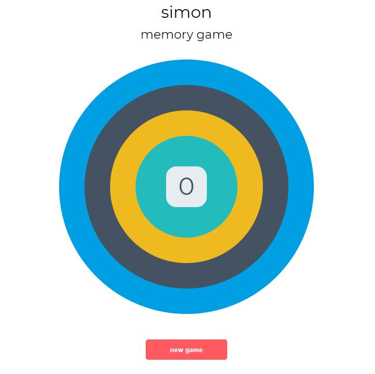

# [Simon Game](https://christ-cc.github.io/Jest-Simon-game/)

Visit live website: [Simon Game](https://christ-cc.github.io/Jest-Simon-game/)

This is a JS memory game, based on the [electronic Simon game](https://en.wikipedia.org/wiki/Simon_(game)) from  the 1980s.

The game will flash the  circles in a random sequence and then you must click on the circles to match the sequence. If you get it right, you get a point and move onto the next round.

This project was built in a Test-Driven development (TDD) approach using Jest. Since it's the first time I used Jest, I commented the code heavily (contrary to *__clean code__* practices), so I can easily understand it and reference it in the future.
I commited the code in a test-code pair so it's easier to review.

*Disclaimer: this is a code along project from [Code Institute](https://codeinstitute.net/)'s **JavaScript Testing With Jest** module*